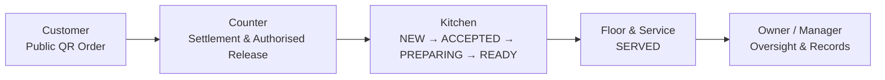
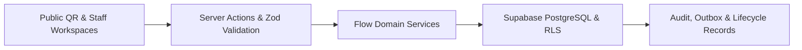

<p align="center">
  
</p>

<h1 align="center">Flow — Operational Command System for Food Businesses</h1>

<p align="center">
  <em>One customer order. One accountable operational flow.</em>
</p>

<p align="center">
  Flow routes the right work to the right people, protects important lifecycle transitions,
  preserves trustworthy records, and turns disconnected food-business operations into one controlled flow.
</p>

<p align="center">
  <a href="https://flow-ops-rho.vercel.app">
    
  </a>
  <a href="https://youtu.be/0StGxEYKGZY">
    
  </a>
</p>

<p align="center">
  
  
  
  
  
</p>

<p align="center">
  <a href="#watch-flow-in-action">Watch</a>
  ·
  <a href="#what-flow-controls">What Flow Controls</a>
  ·
  <a href="#current-product-foundation">Current Build</a>
  ·
  <a href="#product-maturity-roadmap">Roadmap</a>
  ·
  <a href="#run-locally">Run Locally</a>
</p>

---

## Watch Flow in Action

> Follow a Flow order from public QR entry to Counter, Kitchen, Floor & Service, and owner oversight.

<!-- Replace only the src URL below with a github.com/user-attachments/assets/... URL later if one is available. -->

<div align="center">
  <video
    src="https://raw.githubusercontent.com/AbasSec/Flow/main/assets/branding/FLOW.mp4"
    poster="./assets/branding/logo.jpeg"
    width="900"
    controls
  ></video>
</div>

<p align="center">
  <a href="./assets/branding/FLOW.mp4">▶ Open the full Flow walkthrough (.mp4)</a>
  &nbsp;·&nbsp;
  <a href="https://youtu.be/0StGxEYKGZY">Watch on YouTube</a>
  &nbsp;·&nbsp;
  <a href="https://flow-ops-rho.vercel.app">Open the live Flow application and use these as login info , acc : owner@brewbite.demo , 123456 </a>
</p>

> [!NOTE]
> The repository stores the walkthrough at `assets/branding/FLOW.mp4`. If GitHub does not render the repository-hosted video inline, the MP4 and YouTube links above remain available.

---

## What Flow Controls

| Customer | Operations Team | Business Owner |
| --- | --- | --- |
| Safe public QR ordering and narrow order tracking | Counter, Kitchen, and Floor & Service each receive the work they own | Clear lifecycle evidence, controlled decisions, and accountable operational records |

> **One customer order becomes accountable work across Counter, Kitchen, Floor & Service, and owner oversight—without collapsing payment, release, preparation, fulfilment, and closure into one vague status.**

## Why Flow Is Different

| Ordinary ordering flow | Flow operational model |
| --- | --- |
| Captures an order | Routes accountable work |
| Shows one generic status | Keeps payment, release, Kitchen, fulfilment, and closure separate |
| Gives broad access | Enforces role, outlet, and station scope |
| Records activity | Preserves evidence and operational records |
| Focuses on transactions | Builds toward controlled operational decisions |

> **Flow is not another menu website or generic POS screen. It is the operational layer between customer demand, staff execution, and accountable business control.**

---

## The Flow Operating Model



> **Payment, release, Kitchen progress, fulfilment, and closure are separate business truths. Flow does not hide them behind one misleading generic status.**

---

## Current Product Foundation

### ✅ Implemented / Locked

- Protected staff workspace and Supabase authentication foundation.
- Tenant and Row Level Security migration foundation.
- F&B demo data model.
- Staff table ordering and Kitchen board.
- Inventory-backed order flow.
- Owner dashboard and Flow Connect foundation.
- Table-token QR ordering and safe public order tracking.
- Manual demo settlement plus audit/outbox foundation.
- Zod validation boundaries and lifecycle regression coverage.

### 🛠️ Current Milestone — V3.1 / V3.2

- Counter settlement and authorised-release queues.
- Floor & Service ready-to-serve workflow.
- Dashboard routing toward the correct operational workspace.
- Role, outlet, and station-aware private reads.
- Kitchen lifecycle stops at `READY`.
- User-safe errors and lifecycle regression coverage.
- One-outlet QR entry, table selection, and outlet/table server binding.

### ➡️ Next

- Short-lived public ordering contexts.
- HTTP-level rate limiting and replay / abuse controls.
- Compatibility handling around existing `/t/[tableToken]` routes.

### 🗺️ Planned

Dynamic menu management, people and employment foundation, command and records centre, completed counter/table workflows, cost truth, deterministic Flow Analysis, provider-neutral connectors, reporting, notifications, observability, backups, and CI/CD hardening.

> [!IMPORTANT]
> - QR ordering is pay-at-counter. No real payment gateway, POS, terminal, accounting, or delivery connector is implemented.
> - `DEMO_MANUAL_SETTLEMENT` is a manual demo settlement action, not a payment integration.
> - Public routes use opaque tokens and safe projections; they do not expose internal operational records.
> - V3 lifecycle and V3.2 migration work is local/review-stage unless separately applied and deployed.

---

## Role-Specific Workspaces

| Workspace | Primary users | Owns | Does not own |
| --- | --- | --- | --- |
| Dashboard | Owner / Manager | Oversight, risks, evidence, controlled decisions | Normal payment or release queues |
| Counter | Cashier / authorised counter staff | Payment queue, manual settlement, authorised release | Kitchen preparation status |
| Floor & Service | Waiter / service staff | Table ordering, ready-to-serve work, served confirmation | QR payment or release |
| Kitchen | Authorised station staff | `NEW → ACCEPTED → PREPARING → READY` | Settlement, release, serving, collection, closure |
| Public QR | Customer | Permitted order submission and safe tracking | Internal records, staff data, payment internals |

> **Each workspace has a clear owner, a limited responsibility, and a protected operational boundary.**

---

## Trust and Safety by Design

> **Role authority**  
> Actions are limited by the user’s authorised role and server-side checks.

> **Outlet and station scope**  
> Operational access is restricted to the correct business location and Kitchen station.

> **Safe public QR boundaries**  
> Public tokens expose only the minimum customer-facing context.

> **Lifecycle truth**  
> No generic status hides whether payment, release, Kitchen, fulfilment, or closure occurred.

> **Auditability**  
> Sensitive actions preserve actor, time, scope, reason, and evidence where applicable.

> **No fake operational claims**  
> UI states, redirects, messages, or customer claims never prove payment or completed fulfilment.

---

## Product Maturity Roadmap

> Roadmap items are planned product maturity work, not claims that every capability is already implemented.

| Version | Focus | Outcome |
| --- | --- | --- |
| V3.1 | Operational Workspaces | Counter, Floor & Service, dashboard routing, safe role/outlet operations |
| V3.2 | Public Ordering Transition | One-outlet QR, table confirmation, safe public order context |
| V3.3 | Dynamic Menu | Controlled menu, availability, recipes, modifiers, station routing |
| V3.4 | People Foundation | Profiles, employment, invitations, role/outlet/station control |
| V3.5 | Command and Records | Owner/Admin command centre, Team, Records Centre |
| V3.6 | Operational Completion | Full counter/table workflows, tasks, approvals, exceptions |
| V3.7 | Cost Truth | Suppliers, expenses, waste, COGS, profitability foundation |
| V3.8 | Flow Analysis | Evidence-backed insight and responsible next action |
| V3.9 | Connectors | Provider-neutral integration boundaries |
| V3.10 | Hardening | Reports, notifications, export, CI/CD, observability, backups |

---

## Future Differentiators

### Deterministic Flow Analysis — Planned V3.8

Evidence-backed explanations of what is happening, why it matters, what should happen next, and which role should act.

### Command and Records — Planned V3.5

Live operations, scoped records, accountability, and role-aware business control.

### People and Cost Truth — Planned V3.4 / V3.7

Employment context, delegated authority, suppliers, expenses, COGS, labour inputs, and honest profitability labels.

> **Future AI may explain trusted evidence, but it must never autonomously alter payments, inventory, prices, permissions, payroll, or historical records.**

---

## Technical Architecture



| Layer | Verified in repository |
| --- | --- |
| Full-stack application | Next.js App Router 16 and React 19 |
| Language | TypeScript strict mode |
| Styling | Tailwind CSS 4 via PostCSS |
| Database / auth | Supabase clients, migrations, RLS helpers, protected `/app/**` guard |
| Validation | Zod at service and action boundaries |
| Public QR | Opaque outlet, table, menu, and order tokens with safe projections |
| Testing | Vitest, Testing Library packages, SQL regression scripts, static regression tests |
| Local tooling | pnpm 10, Supabase CLI scripts, BrewBite seed script |

> **Database commit is truth. Realtime and refresh behavior are signals after committed state, not the authority.**

---

## Run Locally

### Prerequisites

- Node.js 24 or newer.
- Corepack enabled for pnpm.
- pnpm 10.x.
- Supabase CLI for local database commands.

### Install

```bash
pnpm install
```

### Configure environment

```bash
cp .env.example .env.local
```

Required variables are listed in `.env.example`. Keep server-only secrets such as `SUPABASE_SECRET_KEY` out of browser code and logs.

### Run

```bash
pnpm dev
```

### Verify

```bash
pnpm lint
pnpm typecheck
pnpm test
pnpm build
```

<details>
<summary><strong>Optional local Supabase commands</strong></summary>

<br>

```bash
pnpm db:start
pnpm db:reset
pnpm db:lint
pnpm db:stop
```

</details>

<details>
<summary><strong>Optional BrewBite demo seed</strong></summary>

<br>

Run this only after `.env.local` and local Supabase are configured:

```bash
pnpm seed:brewbite
```

</details>

---

## Quality and Testing

Flow includes:

- ESLint with a zero-warning lint script.
- TypeScript `tsc --noEmit` checking.
- Vitest unit and static regression tests.
- SQL regression coverage for the V3.1 lifecycle kernel.
- Forward-only Supabase migrations.

> A Flow feature is not complete merely because a screen exists. It must be correctly scoped, operationally truthful, and testable.

## Repository Structure

```text
flow/
├── app/                  # Public, login, and staff workspace routes
├── assets/branding/      # Logo and Flow walkthrough video
├── components/           # Shared UI components
├── docs/                 # Decision locks, PRD, reports, and roadmap
├── lib/                  # Auth, services, validation, and domain logic
├── scripts/              # BrewBite demo seed tooling
├── supabase/             # Configuration and forward-only migrations
├── tests/                # Unit, static, and SQL regression tests
├── package.json          # Scripts and verified dependencies
└── README.md             # Product overview and local development guide
```

---

## The Flow Standard

1. Build truthful operations before advanced-looking features.
2. Never fake payment, lifecycle, stock, AI, or integration claims.
3. The correct role must see the correct next action.
4. Every sensitive action must respect authority and scope.
5. The product should explain operational reality with evidence, not vague automation.
6. Flow should feel like a real operating system for food businesses, not a collection of disconnected screens.

<p align="center">
  <strong>BUILD THE TRUTH. ROUTE THE WORK. PROVE THE VALUE.</strong>
</p>
