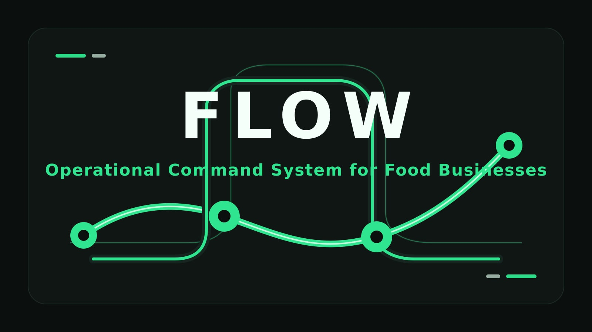
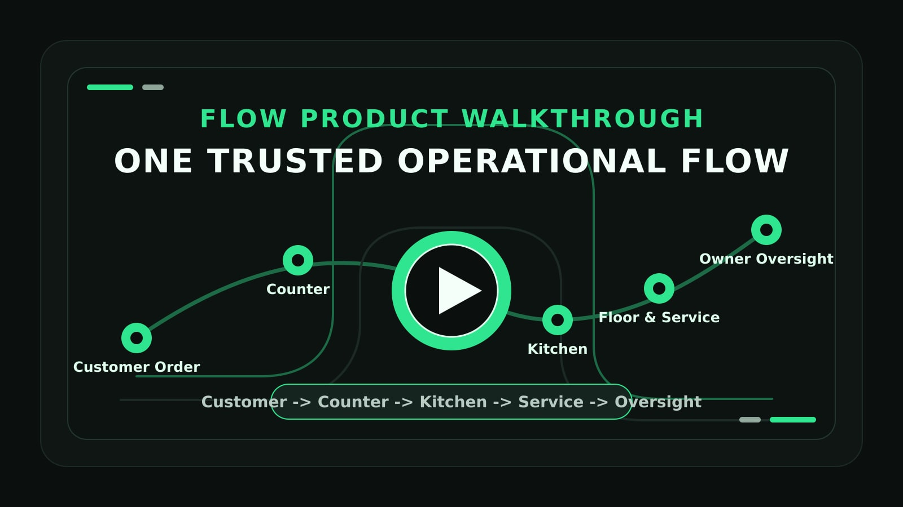
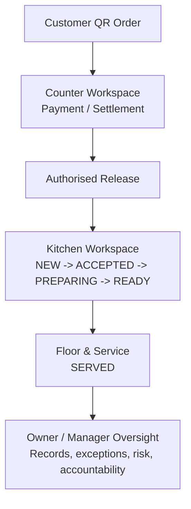
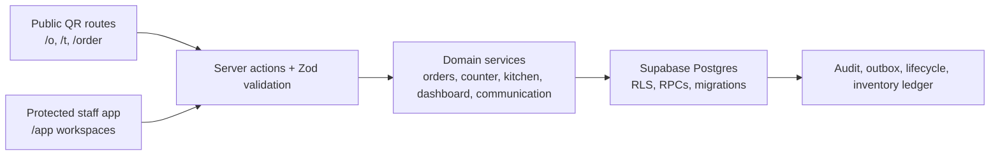

<p align="center">
  
</p>

<p align="center">
  <strong>One trusted operational flow for food businesses.</strong><br>
  From customer order to Counter, Kitchen, Floor &amp; Service, and owner oversight.
</p>

<p align="center">
  <a href="https://flow-ops-rho.vercel.app">
    
  </a>
</p>

<p align="center">
  
  
  
  
  
</p>

# Flow

**Flow is an operational command system for food businesses. It routes the right work to the right people, protects important lifecycle transitions, preserves trustworthy records, and turns disconnected operations into one controlled flow.**

**From customer order to Counter, Kitchen, Floor & Service, and owner oversight—Flow creates one accountable operational truth.**

## What Is Flow?

Food businesses often run ordering, payment, kitchen work, service, and management across disconnected tools. Flow is designed as an operational command system, not another menu website or a generic POS screen.

Each role sees its next relevant action. Payment, release, kitchen progress, fulfilment, and closure are treated as separate business truths with separate owners. The product is built around scoped authority, trustworthy records, and controlled transitions instead of broad access and vague statuses.

## See Flow in Action

> A real walkthrough of Flow’s operational workspaces: customer ordering, Counter, Kitchen, Floor & Service, and owner oversight.

<p align="center">
  <a href="https://youtu.be/0StGxEYKGZY">
    
  </a>
</p>

<p align="center">
  <a href="https://youtu.be/0StGxEYKGZY">
    ▶ Watch the full Flow walkthrough on YouTube
  </a>
</p>

## Why Flow Is Different

| Typical ordering tool | Flow |
| --- | --- |
| Captures an order | Routes accountable work |
| Shows one generic status | Separates payment, release, kitchen, fulfilment, and closure |
| Gives everyone broad access | Enforces role, outlet, and station boundaries |
| Displays activity | Preserves evidence and operational records |
| Focuses only on sales | Builds toward operational control and actionable insight |

## The Flow Operating Model



> Payment, release, kitchen progress, fulfilment, and closure are separate business truths. Flow does not collapse them into one misleading generic status.

## Current Product Foundation

| Status | Repository-backed scope |
| --- | --- |
| ✅ **Implemented / Locked** | Protected staff workspace, Supabase auth foundation, tenant/RLS migrations, F&B demo data model, staff table ordering, kitchen board, inventory-backed order flow, owner dashboard, Flow Connect foundation, table-token public QR ordering, safe public order tracking, manual demo settlement, audit/outbox foundation, TypeScript strict mode, Zod validation boundaries, Vitest/static regression coverage. |
| 🛠️ **Current Milestone** | V3.1 lifecycle separation and operational workspaces: Counter settlement/release queues, Floor & Service ready-to-serve flow, dashboard routing hints, role/outlet/station-aware private reads, kitchen stopping at `READY`, user-safe errors, and lifecycle regression coverage. V3.2 branch adds one-outlet QR entry with table selection and outlet/table server binding. |
| ➡️ **Next** | Complete the remaining public ordering hardening tracked in docs: separately minted short-lived ordering contexts, HTTP-level rate limiting, replay/abuse controls, and compatibility handling around existing `/t/[tableToken]` routes. |
| 🗺️ **Planned** | Dynamic menu management, people/employment foundation, command centre records, completed counter/table workflows, suppliers/expenses/cost truth, deterministic Flow Analysis, provider-neutral connectors, reports, notifications, observability, backups, and CI/CD hardening. |

Current truth boundaries:

- QR ordering is pay-at-counter. No real payment gateway, POS, terminal, accounting, or delivery connector is implemented.
- `DEMO_MANUAL_SETTLEMENT` is a manual demo settlement action, not a payment integration.
- Public routes use opaque tokens and safe projections; they do not expose internal operational records.
- V3 lifecycle and V3.2 migration work is local/review-stage unless separately applied and deployed.

## Role-Specific Workspaces

| Workspace | Primary users | What it owns |
| --- | --- | --- |
| Dashboard | Owner / Manager | Oversight, risks, evidence, exceptions, controlled decisions |
| Counter | Cashier / authorised counter staff | Payment queue, manual settlement, authorised release to Kitchen |
| Floor & Service | Waiter / service staff | Table-service ordering, ready-to-serve queue, served confirmation |
| Kitchen | Authorised station staff | `NEW -> ACCEPTED -> PREPARING -> READY` |
| Public QR | Customer | Permitted order submission and safe public tracking |

Kitchen cannot settle, release, serve, collect, or close orders. Dashboard is oversight, not the normal payment/release workspace. Public customers never receive access to internal operations, staff information, payment internals, inventory, audit records, or Flow Connect.

## Trust And Safety By Design

| Principle | Meaning in Flow |
| --- | --- |
| **Role authority** | Actions are limited by the user's authorised role and server-side checks. |
| **Outlet and station scope** | Operational access is restricted to the correct business location and Kitchen station. |
| **Safe public QR boundaries** | Public tokens expose only minimum customer-facing context. |
| **Lifecycle truth** | A generic status never hides whether payment, release, kitchen, fulfilment, or closure actually happened. |
| **Auditability** | Sensitive actions preserve actor, time, scope, reason, and evidence where applicable. |
| **No fake operational claims** | Browser redirects, UI states, chat messages, or customer claims do not prove payment or completed fulfilment. |

## Product Maturity Roadmap

Roadmap items are planned product maturity work, not claims that every capability is already implemented.

| Version | Theme | Outcome |
| --- | --- | --- |
| V3.1 | Operational Workspaces | Counter queue, Floor & Service queue, dashboard routing, role/outlet-safe operations |
| V3.2 | Public Ordering Transition | One-outlet QR, table confirmation, safe public order context |
| V3.3 | Dynamic Menu | Controlled menu management, availability, recipes, modifiers, station routing |
| V3.4 | People Foundation | Profiles, employment records, invitations, role/outlet/station assignment, payroll foundation |
| V3.5 | Command and Records | Owner/Admin command centre, Team, Records Centre, scoped logs |
| V3.6 | Operational Completion | Full counter/table workflows, fulfilment, tasks, approvals, exceptions |
| V3.7 | Cost Truth | Suppliers, purchases, expenses, waste, COGS, profitability foundation |
| V3.8 | Deterministic Flow Analysis | Evidence-backed insight and recommended accountable action |
| V3.9 | Connectors | Provider-neutral integration boundaries and one approved sandbox integration |
| V3.10 | Hardening | Reports, notifications, export, CI/CD, observability, backups, demo reliability |

## Future Differentiators

| Planned capability | Direction |
| --- | --- |
| **Deterministic Flow Analysis - Planned V3.8** | Explains what is happening, why it matters, the supporting evidence, what should happen next, and which role should act. |
| **Owner / Admin Command Centre - Planned V3.5** | Provides live operational visibility, records and accountability, controlled decisions, and role-aware administration. |
| **People and Cost Truth - Planned V3.4 / V3.7** | Adds employment records, outlet/station assignment, delegated authority, supplier and expense evidence, COGS, labour-cost, and profitability truth. |
| **Connectors - Planned V3.9** | Creates provider-neutral boundaries for future payment, accounting, POS, printer/KDS, supplier, and other approved integrations. |

Future AI may explain trusted evidence, but it must never autonomously alter payments, inventory, prices, permissions, payroll, or historical records.

## Technical Architecture



| Layer | Verified in repository |
| --- | --- |
| Full-stack app | Next.js App Router 16, React 19 |
| Language | TypeScript strict mode |
| Styling | Tailwind CSS 4 via PostCSS |
| Database/auth | Supabase clients, migrations, RLS helpers, protected `/app/**` guard |
| Validation | Zod at service/action boundaries |
| Public QR | Opaque public outlet/table/menu/order tokens and safe projection RPCs |
| Testing | Vitest, Testing Library packages, SQL regression scripts, static regression tests |
| Local tooling | pnpm 10, Supabase CLI scripts, BrewBite seed script |

**Database commit is truth. Realtime or refresh behavior is a hint after committed state, not the authority.**

## Local Development

Prerequisites:

- Node.js 24 or newer
- Corepack enabled for pnpm
- pnpm 10.x
- Supabase CLI for local database commands

Install dependencies:

```bash
pnpm install
```

Create local environment values:

```bash
cp .env.example .env.local
```

Required variables are listed in `.env.example`. Keep server-only secrets such as `SUPABASE_SECRET_KEY` out of browser code and logs.

Run the app:

```bash
pnpm dev
```

Useful checks:

```bash
pnpm lint
pnpm typecheck
pnpm test
pnpm build
```

Supabase local commands defined by the repository:

```bash
pnpm db:start
pnpm db:reset
pnpm db:lint
pnpm db:stop
```

Seed the BrewBite demo only after `.env.local` and local Supabase are configured:

```bash
pnpm seed:brewbite
```

## Quality And Testing

The repository includes:

- ESLint with zero-warning lint script.
- TypeScript `tsc --noEmit` type checking.
- Vitest unit/static tests under `tests/unit`.
- SQL regression coverage under `tests/integration` for the V3.1 lifecycle kernel.
- Supabase migration files for identity/tenancy, audit/outbox, communication, F&B foundation, public QR ordering, public tracking alignment, V3.1 lifecycle, and V3.2 outlet QR.

> A Flow feature is not complete merely because a screen exists. It must be correctly scoped, safe for the user's role, operationally truthful, and testable.

## Repository Structure

```text
flow/
├── app/                  # Next.js App Router public, login, and protected workspace routes
├── assets/branding/      # README branding source and generated hero banner
├── components/           # Shared UI shell and refresh helpers
├── docs/                 # Decision locks, PRD, roadmap, reports, traceability, implementation plan
├── lib/                  # Auth, database clients, domain logic, services, validation
├── scripts/              # BrewBite demo seed script
├── supabase/             # Supabase config and forward-only migrations
├── tests/                # Unit/static tests and SQL integration regression scripts
├── package.json          # pnpm scripts and verified dependencies
└── README.md             # Project overview and local development guide
```

## The Flow Standard

1. Build truthful operations before advanced-looking features.
2. Never fake payment, lifecycle, stock, AI, or integration claims.
3. The correct role must see the correct next action.
4. Every sensitive action must respect authority and scope.
5. The product should explain operational reality with evidence, not vague automation.
6. Flow should feel like a real operating system for food businesses, not a collection of disconnected screens.
