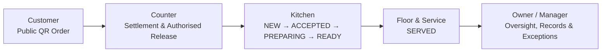
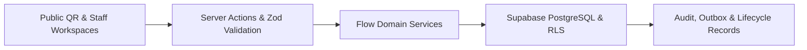

<p align="center">
  
</p>

<h1 align="center">Flow — Operational Command System for Food Businesses</h1>

<p align="center">
  <em>One customer order. One accountable operational flow.</em>
</p>

<p align="center">
  Flow connects public ordering, Counter, Kitchen, Floor &amp; Service, and owner oversight
  into one role-aware operating system for food businesses.
</p>

<p align="center">
  <a href="https://flow-ops-rho.vercel.app">
    
  </a>
  <p>
  acc info for demo ONLY : owner@brewbite.demo / 123456
  </p>
  <a href="https://youtu.be/0StGxEYKGZY">
    
  </a>
  <a href="./LICENSE">
    
  </a>
</p>

<p align="center">
  
  
  
  
  
</p>

<p align="center">
  <strong>Demo access:</strong>
  <code>owner@brewbite.demo</code>
  &nbsp;·&nbsp;
  <code>123456</code>
  <br>
  <sub>Demo environment only — do not reuse these credentials outside the BrewBite demonstration environment.</sub>
</p>

<p align="center">
  <a href="#watch-flow-in-action">Watch</a>
  ·
  <a href="#flow-as-a-product">Product</a>
  ·
  <a href="#how-flow-runs-an-order">How It Works</a>
  ·
  <a href="#what-is-live-now">Current Build</a>
  ·
  <a href="#product-maturity-roadmap">Roadmap</a>
  ·
  <a href="#run-locally">Run Locally</a>
  ·
  <a href="#license">License</a>
</p>

---

## Watch Flow in Action

> Follow a Flow order from public QR entry to Counter, Kitchen, Floor & Service, and owner oversight.

<!-- Uses YouTube's hosted thumbnail so no extra image file is required in this repository. -->
<p align="center">
  <a href="https://youtu.be/0StGxEYKGZY" title="Click to play the full Flow walkthrough on YouTube">
    
  </a>
</p>

<p align="center">
  <a href="https://youtu.be/0StGxEYKGZY">
    
  </a>
</p>

<p align="center">
  <a href="https://youtu.be/0StGxEYKGZY">Watch on YouTube</a>
  &nbsp;·&nbsp;
  <a href="./assets/branding/FLOW.mp4">Open the repository MP4</a>
  &nbsp;·&nbsp;
  <a href="https://flow-ops-rho.vercel.app">Open the live Flow application</a>
</p>

> [!NOTE]
> The preview above is clickable and opens the full walkthrough on YouTube. It uses a YouTube-hosted thumbnail, so this README does not depend on an extra local preview image. The repository copy remains available at `assets/branding/FLOW.mp4`.

---

## Flow as a Product

Flow is a food-business operational command system. It does not stop when a customer submits an order. It turns that order into controlled, role-specific work—then preserves the evidence needed to understand what happened.

| Customer | Counter | Kitchen | Floor & Service | Owner / Manager |
| --- | --- | --- | --- | --- |
| Browse a safe public menu, submit a permitted order, and track only their own order | Review pay-at-counter work, record demo settlement, and authorise release | Work only the station queue assigned to them | Create table orders, see ready work, and record service | See operations, records, risks, and exceptions without becoming every team member’s workspace |

> **One customer order becomes accountable work across Counter, Kitchen, Floor & Service, and owner oversight—without collapsing payment, release, preparation, fulfilment, and closure into one vague status.**

### What makes Flow different

| Ordinary ordering tool | Flow operational model |
| --- | --- |
| Captures an order | Routes accountable work |
| Shows one generic status | Keeps payment, release, Kitchen, fulfilment, and closure separate |
| Gives broad access | Enforces role, outlet, and station scope |
| Records activity | Preserves evidence and operational records |
| Focuses on transactions | Builds toward controlled operational decisions |

> **Flow is not another menu website or generic POS screen. It is the operational layer between customer demand, staff execution, and accountable business control.**

---

## How Flow Runs an Order



> **Payment, release, Kitchen progress, fulfilment, and closure are separate business truths. Flow does not hide them behind one misleading generic status.**

### Current operating rules

| Step | What happens | Primary owner |
| --- | --- | --- |
| Public order | Customer enters an outlet- or table-scoped public route and receives only safe context | Customer |
| Settlement | Pay-at-counter orders remain unpaid until authorised staff record settlement | Counter |
| Release | Settlement alone does not start Kitchen work; authorised release is separate | Counter |
| Preparation | Kitchen progresses assigned station work: `NEW → ACCEPTED → PREPARING → READY` | Kitchen |
| Service | Ready dine-in work becomes served through Floor & Service | Floor & Service |
| Oversight | Owners and managers see work, records, risks, and exceptions | Owner / Manager |

---

## What Is Live Now

### Public ordering and customer safety

- Outlet-level public QR entry is implemented in the repository.
- Customers can enter a table-scoped ordering context through the public flow.
- Existing table-token ordering remains available for compatibility during the transition.
- Public tracking returns narrow customer-safe status rather than internal operational records.
- Public routes use opaque tokens and scoped projections.

### Counter, Kitchen, and Floor & Service

- **Counter** supports QR pay-at-counter work: queue visibility, manual demo settlement, and authorised release.
- **Kitchen** is station-aware and stops at `READY`; it cannot settle, release, serve, collect, or close orders.
- **Floor & Service** supports table-service ordering, a ready-to-serve queue, and served confirmation.
- **Dashboard** is for oversight, evidence, risks, and exceptions—not the normal Counter payment/release queue.

### Business foundations

- Protected private workspaces and Supabase authentication foundation.
- Tenant and outlet boundaries with a Row Level Security migration foundation.
- F&B demo tenant, menu, table, station, and operational seed data.
- Table ordering, Kitchen board, inventory-backed order flow, and safe public tracking.
- Owner dashboard and Flow Connect communication foundation.
- Audit/outbox foundation, Zod validation boundaries, idempotency safeguards, and lifecycle regression coverage.

> [!IMPORTANT]
> - QR ordering is currently **pay at counter**. No real payment gateway, physical terminal, POS, accounting, or delivery connector is claimed as implemented.
> - `DEMO_MANUAL_SETTLEMENT` is a controlled demo settlement action, not a payment-provider integration.
> - Public routes never expose internal operations, staff data, payment internals, inventory, audit records, or Flow Connect.
> - Deployed behaviour depends on the target environment having the required migrations and demo data applied.

---

## Open the Demo

<p align="center">
  <a href="https://flow-ops-rho.vercel.app">
    
  </a>
</p>

Use this **demo-only** owner account:

```text
Email:    owner@brewbite.demo
Password: 123456
```

> [!NOTE]
> This account is for the BrewBite demonstration environment only. Do not reuse the password for a real business account.

---

## Role-Specific Workspaces

| Workspace | Primary users | Owns | Does not own |
| --- | --- | --- | --- |
| Dashboard | Owner / Manager | Oversight, risks, evidence, controlled decisions | Normal payment or release queues |
| Counter | Cashier / authorised counter staff | Payment queue, manual settlement, authorised release | Kitchen preparation status |
| Floor & Service | Waiter / service staff | Table ordering, ready-to-serve work, served confirmation | QR payment or release |
| Kitchen | Authorised station staff | `NEW → ACCEPTED → PREPARING → READY` | Settlement, release, serving, collection, closure |
| Public QR | Customer | Permitted order submission and safe tracking | Internal records, staff data, payment internals |

> **Each workspace has a clear owner, a limited responsibility, and a protected operational boundary.**

---

## Trust and Safety by Design

> **Role authority**  
> Server-side checks limit actions to the user’s authorised role.

> **Outlet and station scope**  
> Operational access is restricted to the correct outlet and Kitchen station.

> **Safe public QR boundaries**  
> Public tokens expose only the minimum customer-facing context.

> **Lifecycle truth**  
> No generic status hides whether payment, release, preparation, fulfilment, or closure occurred.

> **Auditability**  
> Sensitive operations preserve actor, time, scope, reason, and evidence where applicable.

> **No fake operational claims**  
> Redirects, browser states, messages, or customer claims never prove payment or completed fulfilment.

---

## Product Maturity Roadmap

> Roadmap items are product maturity work—not claims that every capability is already completed.

| Version | Focus | Outcome |
| --- | --- | --- |
| V3.1 | Operational Workspaces | Counter, Floor & Service, dashboard routing, safe role/outlet operations |
| V3.2 | Public Ordering Transition | One-outlet QR, table confirmation, safe public order context |
| V3.3 | Dynamic Menu | Controlled menu, availability, recipes, modifiers, station routing |
| V3.4 | People Foundation | Profiles, employment, invitations, role/outlet/station control |
| V3.5 | Command and Records | Owner/Admin command centre, Team, Records Centre |
| V3.6 | Operational Completion | Full counter/table workflows, tasks, approvals, exceptions |
| V3.7 | Cost Truth | Suppliers, expenses, waste, COGS, profitability foundation |
| V3.8 | Flow Analysis | Evidence-backed insight and responsible next action |
| V3.9 | Connectors | Provider-neutral integration boundaries |
| V3.10 | Hardening | Reports, notifications, export, CI/CD, observability, backups |

---

## Future Differentiators

### Deterministic Flow Analysis — Planned V3.8

Flow Analysis will explain what is happening, why it matters, what should happen next, and which authorised role should act.

### Command and Records — Planned V3.5

A stronger owner and admin control surface for live operations, scoped records, accountability, and decisions.

### People and Cost Truth — Planned V3.4 / V3.7

Employment context, delegated authority, supplier and expense evidence, COGS, labour inputs, and honest profitability labels.

> **Future AI may explain trusted evidence, but it must never autonomously alter payments, inventory, prices, permissions, payroll, or historical records.**

---

## Technical Architecture



| Layer | Current implementation direction |
| --- | --- |
| Full-stack application | Next.js App Router 16 and React 19 |
| Language | TypeScript strict mode |
| Styling | Tailwind CSS 4 via PostCSS |
| Database and auth | Supabase clients, migrations, RLS helpers, protected `/app/**` guard |
| Validation | Zod at service and action boundaries |
| Public ordering | Opaque outlet, table, menu, and order tokens with safe projections |
| Testing | Vitest, Testing Library packages, SQL regression scripts, static regression tests |
| Local tooling | pnpm 10, Supabase CLI scripts, BrewBite seed script |

> **Database commit is truth. Realtime and refresh behaviour are signals after committed state, not the authority.**

---

## Run Locally

### Prerequisites

- Node.js 24 or newer.
- Corepack enabled for pnpm.
- pnpm 10.x.
- Supabase CLI for local database commands.

### Install

```bash
pnpm install
```

### Configure environment

```bash
cp .env.example .env.local
```

Required variables are listed in `.env.example`. Keep server-only secrets such as `SUPABASE_SECRET_KEY` out of browser code and logs.

### Run

```bash
pnpm dev
```

### Verify

```bash
pnpm lint
pnpm typecheck
pnpm test
pnpm build
```

<details>
<summary><strong>Optional local Supabase commands</strong></summary>

<br>

```bash
pnpm db:start
pnpm db:reset
pnpm db:lint
pnpm db:stop
```

</details>

<details>
<summary><strong>Optional BrewBite demo seed</strong></summary>

<br>

Run this only after `.env.local` and local Supabase are configured:

```bash
pnpm seed:brewbite
```

</details>

---

## Quality and Testing

Flow includes:

- ESLint with a zero-warning lint script.
- TypeScript `tsc --noEmit` checking.
- Vitest unit and static regression tests.
- SQL regression coverage for the V3.1 lifecycle kernel.
- Forward-only Supabase migrations.

> A Flow feature is not complete merely because a screen exists. It must be correctly scoped, operationally truthful, and testable.

## Repository Structure

```text
flow/
├── app/                  # Public, login, and staff workspace routes
├── assets/branding/      # Flow logo and walkthrough media
├── components/           # Shared UI components
├── docs/                 # Decision locks, PRD, reports, and roadmap
├── lib/                  # Auth, services, validation, and domain logic
├── scripts/              # BrewBite demo seed tooling
├── supabase/             # Configuration and forward-only migrations
├── tests/                # Unit, static, and SQL regression tests
├── package.json          # Scripts and verified dependencies
└── README.md             # Product overview and local development guide
```

---

## The Flow Standard

1. Build truthful operations before advanced-looking features.
2. Never fake payment, lifecycle, stock, AI, or integration claims.
3. The correct role must see the correct next action.
4. Every sensitive action must respect authority and scope.
5. The product should explain operational reality with evidence, not vague automation.
6. Flow should feel like a real operating system for food businesses, not a collection of disconnected screens.

---

## License

<p align="center">
  <a href="./LICENSE">
    
  </a>
</p>

Copyright © 2026 AbasSec.

Flow is released under the [Apache License 2.0](LICENSE).

### What this allows

The Apache License 2.0 permits you to:

- Use Flow for personal, academic, research, hackathon, internal, or commercial work.
- Copy, fork, modify, and redistribute Flow in source or compiled form.
- Build products, services, extensions, integrations, or deployments based on Flow.
- Add your own copyright notices to your original modifications.

### What redistribution requires

When you distribute Flow or a modified version of Flow, you must:

- Include a copy of the [Apache License 2.0](LICENSE).
- Retain applicable copyright, patent, and license notices.
- State significant changes made to files when required by the license.
- Preserve any required notices that accompany the project.

### Branding and demo notice

Please use the Flow name, logo, and product identity accurately. Do not present a fork, modified version, or separate deployment as the official Flow product or imply endorsement by AbasSec without permission.

The BrewBite data, walkthrough, public demo, and demonstration credentials are provided for evaluation and testing. They are not a substitute for production payment processing, data protection, legal compliance, operational security, or deployment hardening.

### No warranty

Flow is provided under the Apache License 2.0 on an **“AS IS”** basis, without warranties or conditions of any kind. Before any real business deployment, conduct appropriate security review, data-protection review, operational testing, backup planning, and legal/compliance assessment.

### Full legal text

Read the complete legally binding terms in the root [LICENSE](LICENSE) file.

---

<p align="center">
  <strong>BUILD THE TRUTH. ROUTE THE WORK. PROVE THE VALUE.</strong>
</p>
