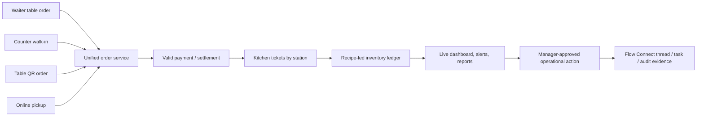
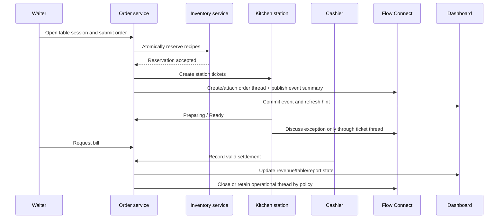
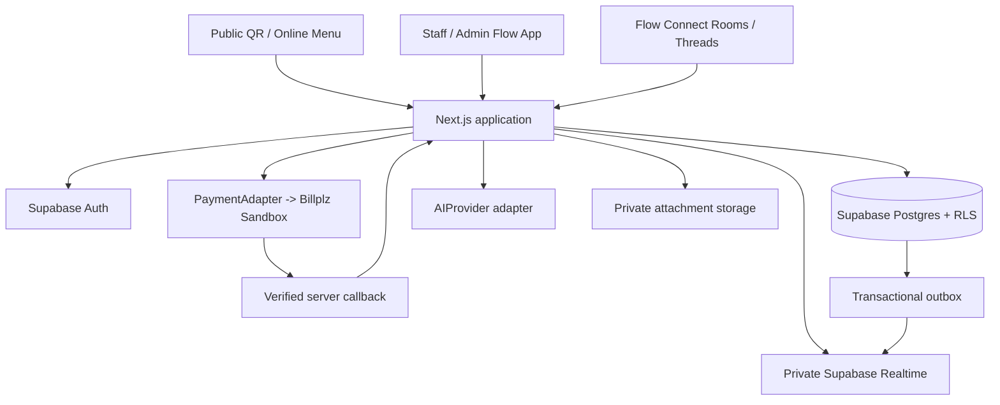

# FLOW — Platform, Communications & F&B Implementation PRD

> **Status:** Decision-locked planning edition v2.0  
> **Last updated:** 1 July 2026  
> **Audience:** Product owner, hackathon team, frontend/backend engineers, QA, design, Claude Code, Codex, and reviewers  
> **Implementation status:** Planning only. Do not bootstrap the application until the product owner approves `docs/IMPLEMENTATION_PLAN.md`.  
> **Document precedence:**  
> 1. `docs/FLOW_DECISION_LOCK_V2.md` — approved product decisions and scope boundaries  
> 2. This PRD — product and engineering blueprint  
> 3. `docs/FLOW_MASTER_CONVERSATION_SOURCE_OF_TRUTH.md` — working summary and historical context  
> 4. `AGENTS.md`, `CLAUDE.md`, `README.md` — repository operating instructions  
>
> When documents conflict, the highest-precedence document wins. No coding agent may silently reinterpret a locked decision.

---

## 0. Executive summary

**Flow** is a configurable operational-control system for organisations that need to coordinate people, workflows, operational data, approvals, and internal communication in one accountable workspace.

Flow is **not** a generic social network, WhatsApp clone, or unfocused “system for everything.” It is an operational product with a reusable core and industry-specific packs.

### Product architecture at a glance

```text
FLOW CORE
├── Organisation, site, team, employee, and role management
├── Internal operational communication: Flow Connect
├── Tasks, incidents, approvals, audit records, and notifications
├── Realtime operational dashboards and reports
├── Data security, tenant isolation, and controlled administration
└── Evidence-grounded Flow Copilot

INDUSTRY PACKS
├── Flow for Food & Beverage — first complete competition proof
├── Future Event Operations Pack
├── Future Retail / Warehouse Pack
├── Future Facilities / Service Operations Pack
└── Other approved case-study packs
```

### First proof pack: Food & Beverage

The competition implementation remains **Flow for Food & Beverage**. It unifies table, counter, QR, and online orders with settlement, kitchen execution, recipe inventory, staff coordination, operational communication, live visibility, and safe manager-approved actions.

### Product promise

> **Flow turns disconnected work, data, and messages into one controlled operational flow: people can see what is happening, communicate in the context of the work, and take accountable next actions.**

### Non-negotiable F&B golden loop



### Core design rule

- **Business truth is deterministic server-side state.**
- **Communication provides context and coordination; it never bypasses workflows, permissions, approvals, payments, stock controls, or audit history.**
- **AI may explain facts and draft a proposal; AI may never change payment state, stock, price, permissions, or historical records.**
- **A Flow Connect direct conversation is company-managed operational communication, not end-to-end private messaging.**

---

## 1. Product identity and strategic position

### 1.1 What Flow is

Flow is a multi-tenant cloud platform with two deliberate layers:

| Layer | Purpose |
|---|---|
| **Flow Core** | Reusable organisation, people, communication, workflow, approval, audit, dashboard, reporting, and security capabilities. |
| **Industry Pack** | Domain-specific entities, workflows, rules, screens, analytics, and terminology. The first pack is Food & Beverage. |

### 1.2 What Flow is not

Flow must not become any of the following:

- A public social-media platform.
- An unmoderated public community.
- A generic “chat app for companies.”
- A giant ERP claiming to handle every industry before it proves one.
- A generic ChatGPT clone.
- An employee-surveillance product.
- A product that fakes payments, stock integrity, realtime behaviour, AI insights, or integrations.

### 1.3 Competition positioning

The competition demo must say:

> **Flow for Food & Beverage is the first complete industry implementation of Flow Core. It proves how one accountable operational workspace can connect orders, kitchen work, inventory, staff coordination, internal communication, and manager-approved action.**

Do **not** claim that every industry pack is built. Present future packs as an extensible product architecture, while demonstrating the F&B pack end-to-end.

### 1.4 Differentiation

Flow differentiates itself through:

1. One operational source of truth across order channels.
2. Work-context communication instead of disconnected WhatsApp-style messages.
3. Role-aware rooms, direct work conversations, handovers, incident coordination, and work-item threads.
4. Factual Team Pulse rather than invasive employee monitoring.
5. Inventory-to-menu action and controlled service recovery.
6. Evidence-backed, constrained AI explanations.
7. Approvals, visibility, and immutable audit history around sensitive actions.

---

## 2. Competition alignment

### 2.1 Digital-transformation gap map

| Challenge | Flow for Food & Beverage answer | Judge-visible proof |
|---|---|---|
| Time-consuming work | One order engine for waiter, counter, QR, and online channels; work-item threads remove repeated calls and disconnected group chats. | Create two orders through different channels and show the same operational record, ticket flow, and live dashboard. |
| Human errors | Central menu/pricing rules, server-side availability, payment controls, recipes, approval policy, immutable historical snapshots. | Exhaust an ingredient and show the item becomes unavailable across public and staff menus. |
| Poor communication | Kitchen status, bill requests, Flow Connect team rooms, order/ticket threads, handover and incident conversations. | A delayed ticket creates a work thread; staff coordinate and the decision is audited. |
| Inefficient customer management | Optional consent-based customer profile/history/feedback; customer communications remain separately scoped. | Manager sees a deliberately identified customer’s history; anonymous guest still works. |
| Poor performance visibility | Live operational dashboard: revenue, channel split, kitchen backlog, staff coverage, stock risk, communication-linked incidents. | Sale and ticket state update dashboard without reload. |
| Lost sales opportunities | QR ordering, online pickup, availability, stock-risk insight, Rescue Mode proposals, approved promotions. | Near-expiry ingredient leads to an evidence-backed manager-approved bundle. |

### 2.2 Mandatory modules

| Requirement | Implementation |
|---|---|
| User management | Platform Super Admin, Organisation Owner, Organisation Admin, Manager, operational staff roles, guest/customer path, active/inactive status, team/site assignment. |
| Core business | Flow Core communication/workflow layer plus F&B unified ordering, kitchen, inventory, payment, expenses, customer history, and staff coordination. |
| Dashboard | Role-aware live KPIs, queue, floor/table state, stock risk, Team Pulse, notifications, incidents, and audited activity. |
| Reports | Sales, channels, kitchen, table turnover, inventory/waste, expenses, staff operations, tasks/incidents, communication oversight, and feedback reports. |
| Settings | Organisation, sites/outlets, teams, roles, approval policy, communication and retention policy, menu/recipes, inventory, privacy, integration, language, and notifications. |

### 2.3 Bonus alignment

| Bonus | Flow capability | Priority |
|---|---|---|
| AI integration | Evidence-grounded Flow Copilot; optional authorised room/work-item summaries later. | P1 |
| Chatbot | Internal role-limited Copilot; Flow Connect is collaboration, not a public chatbot. | P1 |
| Predictive analytics | Forecast, stockout risk, Team Pulse, Rescue Mode. | P1 |
| QR / barcode | Signed table QR in P0; barcode receiving after P0. | QR=P0, barcode=P2 |
| API integration | Payments, realtime backend, AI provider adapters. | P0/P1 |
| Payment gateway | Billplz sandbox hosted checkout with verified callback. | P0 |
| Notifications | In-app realtime notifications; connect mentions and alerts. | P0 foundation / P1 polish |
| Mobile responsiveness | Public menu, waiter, kitchen, manager alerts, Connect room view. | P0 |
| Multi-language | English + Bahasa Melayu for principal F&B and Connect flows. | P1 |
| Cloud deployment | Public demo URL, cloud database/auth/realtime. | P0 |
| CI/CD | Build, test, migration, seed verification. | P1 |
| Containerization | Docker after deployed P0 works. | P1 |

---

## 3. Product scope and release boundaries

### 3.1 P0 — competition vertical slice

P0 is complete only when a fresh session on the public deployment can demonstrate all of the following:

1. Organisation registration or seeded organisation access, secure authentication, tenant isolation, and active membership checks.
2. Platform Super Admin, Organisation Owner, Organisation Admin, Manager, Cashier, Waiter, Kitchen, Storekeeper, and Guest/Customer role boundaries.
3. A private internal Organisation Hub and at least one Team Room, visible only to active organisation members.
4. Direct Work Conversations between active employees, with an in-product company-managed communication notice.
5. A work-item thread linked to a real F&B object, at minimum an order, kitchen ticket, stock issue, approval, or task.
6. Authorised Organisation Owner/Organisation Admin review access to organisation conversations, with reason capture and immutable review audit events.
7. One seeded F&B outlet with menu, recipes, ingredient lots, tables, stations, and staff.
8. Waiter table flow: open table, add items, submit ticket, add later item, request bill, settle, close table.
9. Counter flow: create counter order, cash or external-terminal settlement record, pickup number, kitchen ticket.
10. QR table flow: public table link, safe menu context, server-side cart validation, sandbox hosted checkout, verified payment callback.
11. Callback confirms payment exactly once, creates tickets once, affects stock once, updates dashboard, and cannot be forged via redirect.
12. Kitchen staff see only their assigned station tickets and perform valid state transitions.
13. Recipe-led reservation/consumption, immutable ledger records, and menu availability enforcement.
14. Owner/manager dashboard, core reports, settings, approval flow, audit trail, and protected demo reset.
15. Responsive loading/error/offline-retry states for all network-dependent flows.

### 3.2 P1 — domination layer

Start only after P0 passes end-to-end three consecutive times:

- @mentions, message reactions, message search, room-level unread state, attachments with controlled storage.
- Shift handover rooms and structured handover templates.
- Incident rooms and task creation from a message.
- Role- and outlet-scoped notifications with deduplication.
- Forecasting, stockout risk, Rescue Mode, Flow Copilot, and evidence summaries.
- English/Bahasa Melayu for principal flows.
- CSV and print-friendly PDF export.
- CI/CD and Docker.
- Barcode receiving.
- Configurable retention policy and exports for organisation administrators.

### 3.3 P2 — post-competition roadmap

- Additional industry packs: events, retail/warehouse, facilities, field service, campus operations.
- Configurable workflow templates and custom approved work-item fields.
- Customer/supplier communication portals with separate privacy model.
- Native mobile app.
- Browser push/email/WhatsApp/SMS integrations.
- Direct card-terminal and production acquirer integration.
- Complex split bills, advanced table transfers, delivery routing, loyalty, payroll, accounting, marketplace integrations.
- Full offline transaction engine.
- Advanced compliance/legal retention controls after jurisdiction-specific review.

### 3.4 Explicit exclusions

- No public anonymous organisation groups.
- No feed algorithm, followers, stories, public profiles, social games, or engagement-first features.
- No end-to-end encrypted direct messages while organisation-admin review policy exists.
- No silent administrative reading of direct conversations.
- No platform staff default access to tenant chat content.
- No facial recognition, GPS/background location tracking, keylogging, hidden productivity ranking, automated discipline, or invasive surveillance.
- No card data storage.
- No client-only critical writes.
- No AI direct authority over business state.

---

## 4. Roles, tenancy, and governance

### 4.1 Role model

| Role | Primary authority | Hard limits |
|---|---|---|
| **Platform Super Admin** | Platform tenant setup, support operations, platform health, abuse/suspension controls, system configuration. | No default ability to read tenant messages, orders, staff records, or business data. Exceptional support access must be time-bound, explicitly authorised, and audited. |
| **Organisation Owner** | Full control of one organisation: sites, roles, settings, reports, communications policy, approvals, and audit. | Cannot erase immutable payment, inventory, audit, or review records. |
| **Organisation Admin** | Administers employees, teams, rooms, site assignment, communication policy, operational settings, and permitted reports. | Cannot change platform ownership, access another tenant, or erase immutable records. |
| **Manager** | Operates assigned sites/teams, manages queues, staff tasks, selected reports, and approvals. | No automatic access to all direct work conversations unless separately granted communication-review permission. |
| **Cashier** | Counter POS, settlement recording, receipts, own task/room context. | Cannot self-approve restricted action, modify historic payment, or change policy. |
| **Waiter / Floor staff** | Table sessions, order submission, bill requests, floor status, assigned Connect rooms. | Cannot access financial reports, admin controls, or unrelated rooms. |
| **Kitchen staff** | Assigned station tickets, availability flags, task/room context. | Cannot see revenue, payment details, customer contact information, or admin content. |
| **Storekeeper** | Stock receiving, lot/expiry records, adjustment requests, inventory rooms. | Cannot approve own restricted adjustment or access revenue. |
| **Customer / Guest** | Public menu, permitted order, hosted checkout, own narrow order status. | No Flow Connect, staff data, tenant data, other customer data, or internal conversation access. |

### 4.2 Permission model

Use permissions in addition to role labels. Required permissions include:

```text
organisation.manage
site.manage
team.manage
staff.manage
role.assign
communication.room.manage
communication.message.send
communication.room.invite
communication.audit.review
communication.retention.manage
communication.export
task.manage
approval.decide
audit.read
report.read
payment.configure
payment.settle
inventory.adjust.request
inventory.adjust.approve
```

**`communication.audit.review`** is the explicit authority that grants access to direct work conversations and rooms outside ordinary membership. In the P0 default policy, Organisation Owner and Organisation Admin receive this permission. It must never be given implicitly to every manager.

### 4.3 Tenant isolation

- Every tenant record includes `org_id`.
- Site-scoped core records include `site_id` where relevant.
- F&B records continue to include `outlet_id`; each F&B outlet maps to an organisation site.
- Database RLS and server-side service authorisation must both enforce tenant, site, team, role, and permission scope.
- Hidden UI, guessed route identifiers, or a disabled button never count as access control.

### 4.4 Platform support access

Platform Super Admin support access must use an explicit, time-limited elevation record:

```text
support_access_grant
├── platform_admin_id
├── org_id
├── purpose
├── approved_by_org_owner_id
├── granted_at
├── expires_at
├── scope
└── revoked_at
```

Every tenant record viewed or action performed through elevated support access creates an audit event. P0 may omit the UI for this feature but must preserve the no-default-access policy in architecture and RLS design.

---

## 5. Flow Connect — internal operational communication

### 5.1 Identity

**Flow Connect** is the internal, role-aware communication layer inside Flow.

It is not a standalone communication product. It exists to coordinate operational work, preserve context, and make decisions accountable.

### 5.2 Communication principle

> **Messages belong near the work they affect. A conversation should help a person understand what happened, who owns the next action, and what was decided.**

### 5.3 Room types

| Room type | Audience | Purpose |
|---|---|---|
| `ORG_HUB` | All active organisation employees | Organisation-wide internal updates and discussion. This is internal-only, not internet-public. |
| `ANNOUNCEMENT` | All active employees or selected role/site audience | Admin/manager publishing channel; posting is restricted. |
| `TEAM_ROOM` | Assigned team, relevant manager, authorised admin | Department or operational group coordination. |
| `DIRECT_WORK` | Two employees, or a small employee group | Company-managed direct work conversation. |
| `WORK_ITEM_THREAD` | People assigned to a specific task/order/ticket/approval/incident | Contextual operational discussion. |
| `SHIFT_HANDOVER` | Outgoing/incoming shift staff and managers | Structured shift handover notes. |
| `INCIDENT_ROOM` | Assigned responders, manager, authorised admin | Controlled issue escalation and resolution. |
| `ADMIN_ROOM` | Owner, Organisation Admin, specifically invited managers | Restricted administrative coordination. |

### 5.4 Direct Work Conversations: required transparency

Direct Work Conversations are not personal/private messaging. Before first use, each participant must see and acknowledge this statement:

> **This is a company-managed operational communication workspace. Authorised Organisation Owners and Organisation Administrators may review conversations for operational, security, compliance, safety, or incident-management purposes. Reviews are logged.**

The product must never claim end-to-end encryption, “private DMs,” or invisible administrator access.

### 5.5 Administrative review policy

| Requirement | P0 requirement |
|---|---|
| Who can review all organisation chats | Organisation Owner and Organisation Admin with `communication.audit.review`. |
| Platform Super Admin | No default content access. Only explicit, time-limited approved support elevation. |
| Manager | May view only rooms they belong to or manage unless separately assigned `communication.audit.review`. |
| Review reason | Required before opening a non-member room/direct conversation. |
| Audit event | Required for every review of a direct conversation or non-member room. |
| User transparency | Policy visible in organisation settings and direct-conversation UI. |
| Message deletion | Soft-delete display only; immutable moderation/audit evidence remains according to retention policy. |
| Encryption | Standard platform/database encryption controls permitted; no E2EE because review access is a deliberate product policy. |

### 5.6 Work-item threads

A work-item thread is the most valuable Flow Connect feature. It links messages to an actual record:

```text
ORDER
KITCHEN_TICKET
TABLE_SESSION
INVENTORY_RISK
STOCK_ADJUSTMENT
APPROVAL_REQUEST
STAFF_TASK
SHIFT
INCIDENT
PROMOTION_PROPOSAL
```

Examples:

- A drinks ticket breaches the station target; the manager opens the ticket thread and assigns Packing support.
- A cashier requests approval for a discount; the approval record has its own thread and decision evidence.
- A storekeeper reports an expired lot in an inventory thread; the manager approves a waste adjustment.
- A waiter reports a table issue in the table-session thread; the manager records the resolution.

Messages never change business state directly. The correct action is launched through the relevant Flow command, approval, or task flow.

### 5.7 Message capabilities by release

| Capability | P0 | P1 |
|---|---:|---:|
| Text messages | Yes | Yes |
| Room membership / role scoping | Yes | Yes |
| Direct work conversations | Yes | Yes |
| Work-item threads | Yes | Yes |
| Read state / basic unread count | Yes | Yes |
| Admin review audit | Yes | Yes |
| @mentions | No | Yes |
| Attachments | Optional safe proof only | Yes |
| Reactions | No | Yes |
| Search | No | Yes |
| Edit history | Basic audit-safe policy | Yes |
| Shift handover template | Basic room | Structured templates |
| Task creation from message | No | Yes |
| AI room summary | No | Authorised and evidence-based only |

### 5.8 Communication rules

- Active membership is mandatory to send or view internal messages.
- Deactivated staff lose message access immediately, except lawful/admin export processes under the configured retention policy.
- A user may only create rooms permitted by role/policy.
- Organisation Hub is internal to an organisation; it cannot be searched or joined by people outside the organisation.
- Public customer routes cannot return room data, employee identity data, message metadata, or internal attachment URLs.
- Message payloads must be rate-limited, validated, sanitised, and length-limited.
- Message attachments must use private storage, virus/malware scanning strategy before production, strict content-type/size restrictions, and signed scoped download URLs.
- No raw secrets, card data, or sensitive database output may be pasted into a message. P0 should validate obvious secrets patterns and warn/block where practical.

---

## 6. Flow Core operational workflow layer

### 6.1 Core concepts

Flow Core provides reusable operational primitives without pretending every industry is already implemented:

| Core entity | Purpose |
|---|---|
| Organisation | Tenant boundary and policy owner. |
| Site | Generic operational location, branch, venue, facility, or outlet. |
| Team | Functional group such as Kitchen, Front of House, Logistics, Event Setup, Warehouse. |
| Membership | User-to-organisation/site/team role and active status. |
| Task | Assigned operational work with due time, state, evidence, and audit. |
| Incident | Structured operational issue with severity, owner, state, linked conversation, and resolution. |
| Approval request | Controlled decision record with requester, reason, approver, and before/after payload. |
| Work link | Typed link between a room/thread/task and a pack-specific record. |
| Notification | Role/user/site-scoped event requiring attention. |
| Audit event | Immutable record of sensitive activity. |

### 6.2 Core generic states

```text
Task:
DRAFT → ASSIGNED → IN_PROGRESS → BLOCKED → COMPLETED
DRAFT | ASSIGNED | IN_PROGRESS | BLOCKED → CANCELLED

Incident:
OPEN → ACKNOWLEDGED → MITIGATING → RESOLVED → CLOSED
OPEN | ACKNOWLEDGED | MITIGATING → ESCALATED

Approval:
PENDING → APPROVED | REJECTED | EXPIRED | CANCELLED
```

### 6.3 Industry-pack rule

Future packs may use Flow Core but must define:

1. Their domain objects and state machines.
2. Their role-permission map.
3. Their evidence/audit requirements.
4. Their reports and dashboard metrics.
5. Their public/external access boundary.
6. Their work-item thread links.
7. Their P0 proof workflow.

No pack is considered built merely because it has a chat room and generic task board.

---

## 7. Food & Beverage pack

### 7.1 Supported configurations

| Business type | Enable | Simplify/disable |
|---|---|---|
| Full-service restaurant | Table sessions, waiter ordering, QR tables, counter, kitchen stations, online pickup. | None in demo tenant. |
| Café | Counter, optional QR tables, online pickup, drinks station. | Table service optional. |
| Food-court stall | Counter, pickup numbers, QR menu, online pickup, one station. | Disable table service/service charge. |
| Dessert / bubble-tea outlet | Counter, QR, online pickup, modifiers, drinks station. | Tables optional. |

### 7.2 F&B role capabilities

Existing operational roles retain their specific limits. Flow Connect does not give them extra financial/admin access.

| Role | F&B operations | Connect context |
|---|---|---|
| Cashier | Counter sale, settlement, receipt, pickup | POS/team room, payment/approval thread, own work conversations. |
| Waiter | Table session, submit/add items, bill request | Floor room, table/order thread, own work conversations. |
| Kitchen | Assigned station tickets, preparation status, unavailable flag | Station room, ticket thread, own work conversations. |
| Storekeeper | Receive lots, count stock, adjustment request | Inventory room, inventory-risk/approval thread, own work conversations. |
| Manager | Assigned outlet operations and approvals | Team rooms, incident/approval/work-item threads, assigned Direct Work Conversations. |

### 7.3 F&B golden workflows

#### Dine-in



#### Counter

1. Cashier selects items in POS.
2. Server validates price/modifiers/availability and calculates totals.
3. Server creates draft with an idempotency key.
4. Cash payment or external terminal approval is recorded, or hosted QR payment is initiated.
5. Valid settlement confirms the order once, creates tickets, records stock movement, issues pickup number, updates dashboard, and emits Flow Connect notification/thread context.
6. Kitchen completes the ticket; cashier/customer status updates.

#### QR table / online pickup

1. Guest opens safe `/t/[tableToken]` or `/m/[outletSlug]`.
2. Public API returns only safe menu/context data.
3. Server validates cart and creates short reservation.
4. Server creates payment attempt and hosted checkout.
5. Provider callback is verified server-to-server.
6. Only then does Flow mark payment paid, confirm order, create tickets, commit inventory effects, write audit/outbox, and emit safe events.
7. Payment failure/expiry releases reservation exactly once.

### 7.4 F&B state machines

#### Service status

```text
DRAFT → SUBMITTED → PREPARING → READY → SERVED_OR_COLLECTED → COMPLETED
DRAFT → CANCELLED
SUBMITTED → CANCELLED            (policy controls reservation release)
PREPARING → CANCELLED            (manager approval; consumption remains, waste logged)
READY → CANCELLED                (manager approval; consumption remains, waste/return logged)
```

#### Payment status

```text
UNPAID → PENDING → PAID
UNPAID → PAID
PENDING → FAILED | EXPIRED
PAID → REFUND_REQUESTED → REFUNDED
```

#### Table-session status

```text
AVAILABLE → OPEN → BILL_REQUESTED → SETTLED → CLOSED → AVAILABLE
OPEN → CANCELLED
```

#### Kitchen ticket-line status

```text
NEW → ACCEPTED → PREPARING → READY → COMPLETED
NEW | ACCEPTED → HELD → ACCEPTED
NEW | ACCEPTED → HELD_UNAVAILABLE
```

UI code must never write a status directly. Each valid transition must run through a server-side domain service and create the appropriate audit/outbox/event state.

---

## 8. Communication and F&B interaction rules

### 8.1 Communication never replaces state transition

| Scenario | Correct Flow action | Prohibited shortcut |
|---|---|---|
| Kitchen item unavailable | Kitchen flags `HELD_UNAVAILABLE`; system creates issue/thread; manager decides approved resolution. | Writing “cancel it” in chat and silently changing order. |
| Discount requested | Create approval request; thread contains context; manager approves/rejects through approval command. | Manager saying “okay” in a DM and cashier manually bypassing approval. |
| Stock damage | Storekeeper submits adjustment request; thread includes evidence; manager approves threshold exception. | Editing stock amount because someone wrote a message. |
| Delayed ticket | Ticket thread discusses coverage; manager creates/reassigns a task. | Reordering queue without permission/audit. |
| Customer complaint | Create controlled incident or customer-service task; link relevant safe details. | Posting personal customer data into a broad room. |

### 8.2 Default room topology for BrewBite Kitchen

```text
Organisation Hub — all active staff
Announcements — Owner/Admin/Manager post; staff read
Front of House — waiters, cashier, manager
Kitchen — station users, manager
Inventory & Suppliers — storekeeper, manager
Managers — owner, organisation admin, managers
Shift Handover — active/outgoing/incoming shifts
Order/Ticket/Approval Threads — auto-linked contextual conversations
Direct Work Conversations — authorised active employee pairs/groups
```

---

## 9. Data model and database rules

### 9.1 General conventions

- UUID primary keys, except human-facing reference numbers.
- `amount_sen bigint` for money; never floating point.
- `timestamptz` for timestamps; display in organisation/site timezone.
- PostgreSQL enums or constrained text with canonical TypeScript counterparts.
- Every tenant-owned record includes `org_id`.
- Every sensitive state mutation writes audit data in the same transaction.
- Core and pack modules use immutable historical snapshots when later configuration changes could alter past meaning.

### 9.2 Flow Core entities

| Entity | Required fields / purpose |
|---|---|
| `organisations` | `id`, display/legal name, timezone, currency, owner user id, active state, communication-policy version. |
| `sites` | `id`, `org_id`, name, type, timezone, address/metadata, active. |
| `profiles` | `user_id`, display name, language preference, active state. |
| `org_memberships` | `id`, `org_id`, `user_id`, primary role, active state, policy acknowledgment timestamps. |
| `site_memberships` | User-to-site assignment and role/permission overrides. |
| `teams` | `id`, `org_id`, optional `site_id`, name, type, active. |
| `team_memberships` | Team assignment, membership role, active. |
| `permission_grants` | Explicit permission grants/revocations where needed. |
| `communication_rooms` | Type, title, org/site/team scope, creator, policy, active/archive state. |
| `room_memberships` | User membership, room role, muted/read state, active state. |
| `messages` | Room, author, body, sanitised/plain content, reply parent, created/edited/deleted state. |
| `message_attachments` | Private-storage metadata, safe media type, size, scan state, uploader. |
| `message_mentions` | Mentioned user/team references. |
| `message_reads` | Per-user last-read cursor or message id. |
| `work_item_threads` | Typed target (`entity_type`, `entity_id`) linked to room/thread. |
| `communication_review_events` | Reviewer, room/conversation, reason, policy version, timestamp. |
| `communication_retention_policies` | Organisation policy version, retention days, export/delete rules, acknowledgement. |
| `staff_tasks` | Task state, assignee, due date, linked work object, evidence. |
| `incidents` | Severity, state, reporter, owner, linked room/work item, resolution. |
| `approval_requests` | Restricted action payload, requester, approver, result, reason, expiry. |
| `notifications` | User/role/team/site scope, dedupe key, read state. |
| `audit_events` | Immutable actor/action/object/before-after/reason/metadata. |
| `outbox_events` | Durable post-commit event record. |
| `support_access_grants` | Time-bound platform support elevation, purpose, approval/audit data. |

### 9.3 F&B entities

| Entity | Required purpose |
|---|---|
| `outlets` | F&B extension of a site: service/tax policy, channel settings. |
| `floors`, `restaurant_tables`, `table_sessions` | Physical floor/table and visit/bill state. |
| `menu_categories`, `menu_items`, `menu_item_modifiers` | Menu, pricing, public availability, station mapping. |
| `recipe_versions`, `recipe_lines` | Immutable recipe-to-ingredient mapping. |
| `ingredients`, `stock_lots`, `inventory_ledger` | Ingredient truth, lot/expiry, append-only movements. |
| `orders`, `order_lines` | Operational and payment state, immutable snapshots. |
| `kitchen_tickets`, `ticket_lines` | Station work and status. |
| `payment_attempts`, `cashier_settlements` | Hosted/manual settlement truth. |
| `customers`, `customer_order_links` | Optional consented customer records. |
| `expenses` | Purchase/cost controls. |
| `forecast_snapshots`, `promotion_proposals` | P1 intelligence evidence. |

### 9.4 Communication constraints and indexes

```sql
create unique index communication_rooms_org_type_title_active_key
  on communication_rooms (org_id, room_type, normalized_title)
  where archived_at is null and room_type in ('ORG_HUB', 'ANNOUNCEMENT');

create unique index work_item_threads_target_key
  on work_item_threads (org_id, entity_type, entity_id);

create index messages_room_created_idx
  on messages (room_id, created_at desc)
  where deleted_at is null;

create index room_memberships_user_room_idx
  on room_memberships (user_id, room_id)
  where left_at is null;

create index communication_review_events_org_created_idx
  on communication_review_events (org_id, created_at desc);

create index messages_org_author_created_idx
  on messages (org_id, author_user_id, created_at desc);
```

### 9.5 Inventory ledger rule

`inventory_ledger` remains append-only and is the sole authority over stock movement.

```text
available quantity = on_hand quantity - active reservations
menu item available servings = limiting available recipe ingredient
```

No message, dashboard widget, client mutation, or AI answer may directly modify stock.

---

## 10. Security, privacy, audit, and retention

### 10.1 Security requirements

- RLS on all tenant/business tables.
- Server-side command services/database RPCs for critical writes.
- Zod validation for every command endpoint.
- Rate limits on public, chat, and AI endpoints.
- Output encoding and sanitisation for messages.
- Private storage and signed URLs for attachments.
- No Supabase secret/service key in browser code, logs, snapshots, or commits.
- No raw provider errors or stack traces in UI.
- Transactional outbox for critical updates.
- Realtime channels are private and authorised; broadcasts are refresh hints only.

### 10.2 Communication privacy model

- Internal rooms and Direct Work Conversations are restricted to the organisation, not public internet content.
- Conversation review policy must be visible in organisation settings and acknowledged by staff.
- Review of non-member/private direct work conversations requires the reviewer to provide a reason and creates an immutable review event.
- Admin review events are visible to Owner/Organisation Admin in audit/reporting. Whether participants are notified in-app can be made policy-configurable only after legal/product review; P0 must never imply invisible private messaging.
- Organisation administrators must be able to configure retention policy version, but P0 should use a documented default and not claim jurisdiction-specific compliance certification.
- Production launch requires jurisdiction-specific privacy, employment, retention, and workplace-notice review.

### 10.3 Audit requirements

Sensitive actions must record actor, organisation, site/outlet where relevant, object, before/after JSON where meaningful, reason, approval reference, timestamp, and request/correlation id.

Required audited actions include:

```text
role assigned/revoked
employee activated/deactivated
room created/archived
room membership changed
direct work conversation reviewed
message moderation/deletion
retention policy changed
task created/reassigned/completed
incident opened/escalated/resolved
discount/void/refund/price override
stock receipt/adjustment/waste
payment settlement/callback outcome
menu/recipe configuration change
promotion proposal decision
support elevation granted/revoked
```

---

## 11. Technology architecture

### 11.1 Prescribed stack

| Layer | Choice | Rule |
|---|---|---|
| Application | Next.js App Router + React + strict TypeScript | One repository for public F&B, private staff app, Flow Connect, APIs, and deployment. |
| UI | Tailwind CSS + accessible headless/shadcn components + Lucide icons | Touch-first operations and communication views; desktop-first reports/settings. |
| Auth/database/storage/realtime | Supabase Auth + PostgreSQL + Storage + Realtime | RLS is mandatory on every tenant table. |
| State/query | TanStack Query | Realtime invalidates/refetches authorised data. |
| Forms/validation | React Hook Form + Zod | Validate client UX and server authority. |
| Payments | Provider adapter; Billplz sandbox P0 | Hosted checkout, verified callback, idempotency. |
| AI | Provider adapter behind server boundary | Keys server-only; limited facts only. |
| Reporting | Server-side SQL/RPC or typed query layer + Recharts | Reports read source-of-truth records. |
| Testing | Vitest + Testing Library + Playwright | State, RLS, security, callback, communication access, and E2E flows. |
| Deployment | Vercel or equivalent + Supabase Cloud | Separate preview/demo environments. |

### 11.2 System context



### 11.3 Architecture constraints

1. All critical business and administrative mutations happen through server services or controlled RPCs.
2. A message is not an approval, payment decision, stock adjustment, or state transition.
3. Every critical F&B confirmation transaction writes order/payment/ticket/ledger/audit/outbox effects atomically.
4. Realtime publish occurs after commit; clients refetch authorised source data.
5. Chat must never allow cross-tenant read/write through guessed room ids, message ids, attachment keys, or realtime channels.
6. Payment callbacks are idempotent.
7. Public QR uses opaque tokens, never raw internal ids.
8. The architecture must preserve future packs without weakening current F&B complexity and audit controls.

---

## 12. API and service contracts

### 12.1 General API rules

- Validate every command with Zod.
- Use authenticated server session plus domain service.
- Require idempotency key for user-initiated create/settle/approve commands.
- Return typed safe errors: `VALIDATION_ERROR`, `FORBIDDEN`, `CONFLICT`, `NOT_FOUND`, `OUT_OF_STOCK`, `PAYMENT_PENDING`, `PAYMENT_FAILED`, `RATE_LIMITED`, `INTERNAL_ERROR`.
- Never return raw database/provider/system errors.

### 12.2 Flow Connect commands

| Route | Method | Access | Purpose |
|---|---|---|---|
| `/api/connect/rooms` | POST | Owner/Admin/allowed manager | Create permitted room. |
| `/api/connect/rooms/{id}/members` | POST | Room manager/Admin | Add permitted room member. |
| `/api/connect/rooms/{id}/messages` | POST | Active room member | Send validated text/reply. |
| `/api/connect/messages/{id}/read` | POST | Active room member | Advance read cursor. |
| `/api/connect/messages/{id}` | PATCH | Author/moderator policy | Edit according to policy and audit. |
| `/api/connect/messages/{id}` | DELETE | Author/moderator policy | Soft-delete display, preserve audit evidence. |
| `/api/connect/direct` | POST | Active employee | Find/create Direct Work Conversation per policy. |
| `/api/connect/work-items/{type}/{id}` | GET/POST | Authorised linked users | View/create contextual thread. |
| `/api/connect/reviews` | POST | `communication.audit.review` | Open/review a non-member room; reason mandatory. |
| `/api/connect/attachments` | POST | Active room member | Create scoped upload flow. |
| `/api/connect/search` | GET | P1 | Authorised message search. |

### 12.3 Existing F&B command routes

```text
POST /api/orders/table-sessions
POST /api/orders/table-sessions/{id}/lines
POST /api/orders/{id}/request-bill
POST /api/orders/counter
POST /api/orders/{id}/settle-cash
POST /api/orders/{id}/settle-terminal
POST /api/public/checkout
POST /api/payments/billplz/callback
POST /api/kitchen/tickets/{id}/status
POST /api/inventory/receipts
POST /api/inventory/adjustments
POST /api/approvals/{id}/decision
POST /api/tasks
POST /api/incidents
GET  /api/reports/{report}
POST /api/ai/insights
POST /api/demo/reset
```

### 12.4 Payment truth contract

Only a verified server-to-server provider callback can mark a hosted-gateway payment as `PAID`.

The callback must:

1. Read raw provider payload.
2. Verify signature per current official provider documentation.
3. Match trusted provider reference, expected collection/merchant context, and exact amount.
4. Lock payment/order/reservation records.
5. Persist normalised callback evidence/payload hash without unnecessary PII.
6. Apply `PENDING → PAID` exactly once.
7. Atomically create tickets, stock effects, audit/outbox state.
8. Return success for duplicate valid callbacks without duplicate effects.

Browser redirects are customer experience only; they may display “Checking payment…” but cannot set payment status.

---

## 13. Realtime event contract

### 13.1 Private channel conventions

```text
flow:org:{orgId}
flow:org:{orgId}:site:{siteId}
flow:org:{orgId}:outlet:{outletId}
flow:org:{orgId}:outlet:{outletId}:station:{stationId}
flow:org:{orgId}:room:{roomId}
flow:org:{orgId}:user:{userId}
```

Use authorised private channels only. A public customer order-status view uses a separate narrow tokenised endpoint/channel with safe status data only.

### 13.2 Event types

```text
room.created
room.membership_changed
message.created
message.updated
message.deleted
message.read
message.mention
communication.review_recorded
task.created
task.updated
incident.created
incident.updated
order.created
order.confirmed
order.payment_paid
order.service_status_changed
ticket.created
ticket.status_changed
inventory.changed
table.changed
notification.created
approval.changed
promotion.published
```

### 13.3 Realtime correctness rule

```text
Domain transaction commits
→ outbox event persists in same transaction
→ post-commit publisher sends narrow event summary
→ authorised client receives event
→ client refetches source-of-truth data
```

Database state is truth. Broadcasts are an acceleration layer, not the truth source.

---

## 14. Screens, routes, and UX requirements

### 14.1 Public F&B routes

| Route | Purpose |
|---|---|
| `/m/[outletSlug]` | Public online-pickup menu. |
| `/t/[tableToken]` | Table-specific QR menu and cart. |
| `/checkout/[attemptId]` | Hosted-payment return/checking screen. |
| `/order/[publicOrderId]` | Narrow safe order status. |

Public routes must never expose Flow Connect, internal staff identities, staff availability, business reports, chat metadata, attachments, or private data.

### 14.2 Private operational routes

| Route | Primary user | Purpose |
|---|---|---|
| `/app/dashboard` | Owner/Manager | Operational command centre. |
| `/app/connect` | Active employees | Room list, unread activity, search later. |
| `/app/connect/room/[roomId]` | Authorised members | Team/announcement/admin room conversation. |
| `/app/connect/direct/[roomId]` | Participants/reviewers | Company-managed Direct Work Conversation. |
| `/app/connect/work/[entityType]/[entityId]` | Linked users | Contextual order/ticket/task/approval/incident thread. |
| `/app/pos` | Cashier | Counter order and settlement. |
| `/app/floor` | Waiter/Manager | Table grid and sessions. |
| `/app/kitchen/[stationId]` | Kitchen | Station ticket board. |
| `/app/inventory` | Storekeeper/Manager | Lots, stock, expiry, adjustments. |
| `/app/team` | Manager/Owner/Admin | Staff, teams, shifts, tasks, Team Pulse, approvals. |
| `/app/customers` | Manager/Owner | Consent-based customer profiles/history. |
| `/app/reports` | Manager/Owner/Admin | Filtered report catalogue. |
| `/app/settings` | Owner/Admin | Organisation, roles, communication policy, F&B configuration. |
| `/app/audit` | Owner/Admin | Audit and conversation-review records. |
| `/platform` | Platform Super Admin | Platform operations only; no default tenant content. |

### 14.3 UX rules

- Each role sees immediate operational next actions, not every feature.
- Connect must be visually integrated into Flow: it is a work rail/tab, not a separate social-network experience.
- Work-item threads should open from the corresponding order, ticket, task, incident, or approval record.
- Use status text plus icon/shape; never colour alone.
- High-risk action requires confirmation and reason.
- Every network screen needs loading, empty, error, retry, and permission-denied states.
- Kitchen, waiter, public menu, and Connect room must work on phone/tablet.
- Dashboards, settings, reports, audit, and admin screens must be strong on desktop.
- Direct Work Conversation screen must show company-managed policy in a non-intrusive but clear location.

---

## 15. Dashboard, reports, settings, and controls

### 15.1 Dashboard widgets

- Today revenue, orders, average order value, channel split.
- Order funnel: unpaid/pending/submitted/preparing/ready/completed/cancelled.
- Kitchen backlog, oldest ticket age, station delay threshold.
- Table occupancy and bill requests.
- Top, slow, and unavailable items.
- Stock risk: low reserve, near expiry, availability effect.
- Team Pulse: planned/active coverage, factual station load, unassigned tasks.
- Connect activity: urgent mentions, open incident rooms, unacknowledged handovers, approval threads requiring decision.
- Audit/activity feed for payments, stock, kitchen, approvals, operational communication review, and promotions.

### 15.2 Report catalogue

| Report | Decision supported |
|---|---|
| Sales and channels | Revenue source and channel performance. |
| Menu performance | Item/category/station/time-block decisions. |
| Kitchen service | Operational bottleneck analysis. |
| Table turnover | Dine-in capacity and service flow. |
| Inventory and waste | Stock-value protection. |
| Expenses/purchases | Cost control. |
| Staff operations | Fair coverage and task planning. |
| Tasks and incidents | Operational issue load, resolution time, ownership. |
| Communication governance | Room activity, acknowledgement, review audit, policy adherence; never a secret employee-surveillance score. |
| Customers/feedback | Improve experience with consent-aware data. |

All reports require date range, scope filter, relevant search/filter, visual summary, CSV export, and print-friendly PDF output when P1 is completed.

### 15.3 Settings

- Organisation profile and policy version.
- Sites/outlets and operating hours.
- Teams, staff roles, memberships, active status, approval thresholds.
- Communication policy: allowed room types, membership rules, review authority, review reason prompt, retention policy version, attachment policy, restricted terms policy.
- Floors/tables/QR rotation.
- Menu, modifiers, prices, service/tax, recipes, stations.
- Ingredients, lots, expiry/reserve thresholds, suppliers, expenses.
- Customer-consent copy/version.
- Payment adapter configuration state without displaying secrets.
- Language, notifications, logo, receipt template.

---

## 16. Intelligence layer

### 16.1 Flow Copilot boundary

Flow Copilot is an internal, constrained operational assistant. It is not a generic chatbot and does not have unrestricted access to Flow Connect history or raw database tables.

It may answer authorised, typed operational questions using minimised structured facts. It may draft actions, but normal Flow services enforce every state-changing command and approval.

### 16.2 Allowed F&B intents

```text
SALES_SUMMARY
SALES_CHANGE_EXPLANATION
ORDER_QUEUE_STATUS
KITCHEN_DELAY_EXPLANATION
TABLE_STATUS
MENU_AVAILABILITY
INVENTORY_RISK
RESTOCK_RECOMMENDATION
PREP_RECOMMENDATION
STAFF_ON_SHIFT
STAFF_TASK_STATUS
STATION_WORKLOAD
PAYMENT_SUMMARY
REPORT_EXPLANATION
```

### 16.3 Communication-aware AI rule

- P0: Copilot does not read room message bodies by default.
- P1: An authorised user may request a summary of a specific room, thread, handover, or incident. The service must verify room access first, minimise input, label the time range/source/freshness, and show evidence.
- AI summaries cannot reveal messages from a room the requesting user cannot access.
- AI may not infer employee performance scores or make disciplinary recommendations.
- AI may not use private direct conversation content for unrelated analytics.
- The organisation policy must disclose any AI summary capability before use.

### 16.4 Forecast formula

```text
forecast(item, outlet, time_block) =
  0.50 * comparable_same_weekday_timeblock_average
+ 0.30 * last_7_operating_day_average
+ 0.20 * current_week_trend_adjustment
```

Require at least 14 complete operating days and two comparable observations; otherwise return:

```text
Forecast unavailable — build more history.
```

---

## 17. Testing and acceptance matrix

### 17.1 Unit tests

- Role, permission, tenant, site, and team access guards.
- Room creation/membership validation.
- Direct Work Conversation policy acknowledgement requirement.
- Admin review requires `communication.audit.review` and non-empty reason.
- Review events immutable and correctly scoped.
- Message sanitisation, length/rate limits, reply and soft-delete rules.
- Work-item thread link validation.
- Order/table/payment/kitchen state transition tables.
- Money/tax/discount integer calculation.
- Inventory reservation, FEFO consumption, release/waste logic.
- Approval policy and self-approval rejection.
- Callback HMAC/signature verification fixtures.
- AI fact serialiser excludes personal/secret data.
- AI room-summary access guard (P1).

### 17.2 Integration tests

- Organisation A cannot read/write Organisation B rooms/messages/attachments/realtime content.
- Deactivated employee cannot send/read new messages.
- Manager without review permission cannot access employee direct conversation.
- Organisation Admin review succeeds only with a reason and creates one review event.
- Platform Super Admin has no tenant chat access without valid support elevation.
- Work-item thread only exposes linked operational object to permitted users.
- Payment callback remains idempotent.
- Forged redirect cannot set payment status.
- Concurrent final-stock reservation allows only one checkout.
- Kitchen user cannot access payment/report/admin endpoints.
- Cancel-before-prep releases reservations; cancel-after-prep preserves consumption and logs waste.
- Demo reset returns known seed counts and active room topology.

### 17.3 Playwright end-to-end tests

1. Owner/Admin logs in, creates staff member/team, views Organisation Hub.
2. Two active employees exchange Direct Work Conversation messages and see company-managed notice.
3. Organisation Admin reviews that direct conversation with reason; audit shows review event.
4. Waiter opens table, submits order, kitchen sees ticket, ticket thread opens, cashier settles, table resets.
5. Cashier counter sale produces receipt/pickup/ticket/dashboard update.
6. Mobile QR menu checkout uses valid callback fixture and safe order status.
7. Public user cannot discover `/app/connect`, room content, staff identity, private attachments, or another table/order.
8. Kitchen staff can use their station room/thread but cannot view financial/admin rooms.
9. Inventory exhaustion blocks public menu item.
10. Protected demo reset restores dataset and core rooms.

### 17.4 Definition of done

A feature is not complete unless it:

1. Has explicit role/tenant/site/team access policy.
2. Has validation, loading, empty, error, retry, and denied states.
3. Writes audit/outbox state if business-sensitive.
4. Has tests proportional to risk.
5. Does not expose PII, secrets, raw errors, cross-tenant records, or unauthorised chat.
6. Does not weaken F&B payment/inventory truth.
7. Follows Decision Lock v2.

---

## 18. Deployment, CI/CD, and environment

### 18.1 Environments

| Environment | Purpose |
|---|---|
| Local | Developer work with local or isolated Supabase. |
| Preview | Branch testing with sandbox/test data. |
| Demo/staging | Judge-facing seeded tenant and sandbox payment configuration. |
| Production later | Separate credentials, lawful/privacy review, backup, support, and retention operations. |

### 18.2 Required commands

```bash
pnpm install
pnpm dev
pnpm lint
pnpm typecheck
pnpm test
pnpm test:integration
pnpm test:e2e
pnpm build
pnpm db:reset
pnpm seed:demo
```

### 18.3 GitHub Actions pipeline

```text
checkout
→ setup Node + pnpm cache
→ install frozen lockfile
→ lint
→ typecheck
→ unit tests
→ integration tests against isolated test backend
→ build
→ clean migration apply/check
→ seed demo verification
→ optional Playwright smoke
→ deploy demo only after main passes
```

### 18.4 Environment variables

```bash
# App
NEXT_PUBLIC_APP_URL=http://localhost:3000
NODE_ENV=development

# Supabase browser-safe
NEXT_PUBLIC_SUPABASE_URL=
NEXT_PUBLIC_SUPABASE_PUBLISHABLE_KEY=

# Supabase server-only
SUPABASE_SECRET_KEY=

# Payment provider
PAYMENT_PROVIDER=billplz
BILLPLZ_BASE_URL=
BILLPLZ_API_KEY=
BILLPLZ_X_SIGNATURE_KEY=
BILLPLZ_COLLECTION_ID=
BILLPLZ_CALLBACK_URL=
BILLPLZ_REDIRECT_URL=

# AI provider (server-only)
AI_PROVIDER=
AI_API_KEY=
AI_MODEL=

# Operational security
CRON_SECRET=
DEMO_RESET_SECRET=
ATTACHMENT_SIGNING_SECRET=
```

Validate environments at startup. Never commit live keys. Demo/production must fail closed when required payment/auth/security configuration is absent.

---

## 19. Demo tenant and presentation

### 19.1 Demo tenant: BrewBite Kitchen

Use a realistic fictional Malaysian F&B organisation:

- One outlet/site with 12 tables.
- Counter takeaway, table service, QR table ordering, online pickup.
- Stations: Drinks, Grill, Pastry.
- 10–15 menu items, modifiers, versioned recipes.
- 12–18 ingredients, including one near-expiry lot.
- 45 days of internally consistent history.
- 6–8 staff across roles.
- Default Flow Connect topology: Organisation Hub, Announcements, Front of House, Kitchen, Inventory, Managers, Shift Handover, contextual threads.
- One active shift, one approval, one near-stockout, one kitchen delay, and one communication-linked incident.

### 19.2 Four-minute demo

1. **Problem:** F&B teams use disconnected channels for orders, kitchen, stock, and staff messages.
2. **Flow Core:** Show organisation/role-aware communication, not a public social feed.
3. **Dine-in:** Waiter submits Table 6 order; tickets route by station.
4. **Work context:** Open the ticket/order thread; kitchen flags an issue and manager assigns support through an auditable task.
5. **Counter:** Cashier completes walk-in sale; pickup/ticket/stock/dashboard update.
6. **QR/payment:** Guest pays using hosted sandbox flow; verified callback confirms exactly one order.
7. **Control:** Manager approves a restricted stock adjustment or discount; audit proves accountability.
8. **Magic:** Team Pulse detects station pressure; Rescue Mode flags near-expiry batch and proposes a manager-approved bundle.
9. **Close:** Flow is not just POS or chat; it connects operational data, people, decisions, and outcomes.

### 19.3 Judge questions

| Question | Required answer |
|---|---|
| Is this a social-media app? | No. Flow Connect is a private, role-aware operational communication layer attached to real work and controlled by organisation policy. |
| Can admins read DMs? | Direct Work Conversations are explicitly company-managed. Only authorised Organisation Owners/Admins with review permission may review them, reasons and review events are audited, and this policy is visible to staff. |
| Can Flow staff read every business chat? | No. Platform Super Admin has no default tenant content access. Any support elevation must be explicitly approved, time-bound, and audited. |
| Why is F&B still important? | F&B is the first fully operational industry pack and proof workflow: orders, payments, kitchen, inventory, staff coordination, and communication are all connected. |
| How is payment real? | Hosted provider callback is server-side, signature-verified, amount/reference-checked, and idempotent; redirect is UI only. |
| Can AI change things? | No. AI explains evidence and drafts proposals. Standard Flow permissions, approvals, and services execute any real change. |

---

## 20. Repository layout

```text
flow/
├── AGENTS.md
├── CLAUDE.md
├── README.md
├── docs/
│   ├── FLOW_DECISION_LOCK_V2.md
│   ├── FLOW_PRD_IMPLEMENTATION.md
│   ├── FLOW_MASTER_CONVERSATION_SOURCE_OF_TRUTH.md
│   ├── IMPLEMENTATION_PLAN.md              # planning-only, generated after approval
│   ├── API_CONTRACT.md
│   ├── COMMUNICATION_POLICY_TEMPLATE.md
│   ├── DEMO_SCRIPT.md
│   └── CHANGELOG_V2_PLATFORM_PIVOT.md
├── app/
│   ├── (public)/
│   ├── (auth)/
│   ├── app/
│   │   ├── dashboard/
│   │   ├── connect/
│   │   ├── pos/
│   │   ├── floor/
│   │   ├── kitchen/
│   │   ├── inventory/
│   │   ├── team/
│   │   ├── reports/
│   │   ├── settings/
│   │   └── audit/
│   ├── platform/
│   └── api/
│       ├── connect/
│       ├── tasks/
│       ├── incidents/
│       ├── orders/
│       ├── payments/
│       ├── public/
│       └── demo/
├── components/
│   ├── connect/
│   ├── operations/
│   ├── pos/
│   ├── kitchen/
│   ├── dashboard/
│   └── shared/
├── lib/
│   ├── auth/
│   ├── db/
│   ├── services/
│   │   ├── communication.ts
│   │   ├── tasks.ts
│   │   ├── incidents.ts
│   │   ├── orders.ts
│   │   ├── payments.ts
│   │   ├── inventory.ts
│   │   ├── kitchen.ts
│   │   ├── approvals.ts
│   │   ├── reports.ts
│   │   └── intelligence.ts
│   ├── integrations/
│   ├── validation/
│   ├── i18n/
│   └── realtime/
├── supabase/
│   ├── migrations/
│   ├── seed.sql
│   └── functions/
├── tests/
│   ├── unit/
│   ├── integration/
│   └── e2e/
└── .github/workflows/ci.yml
```

---

## 21. Implementation milestones and four-person ownership

### 21.1 Milestones

| Milestone | Deliverable | Gate |
|---|---|---|
| 0 — Guardrails | Repo docs, environment validation, test scaffolding, migration/seed plan. | Agent can run documented commands; no scope ambiguity. |
| 1 — Identity & tenancy | Auth, org/site/team model, roles, permissions, RLS, seed membership. | Tenant and role isolation tested at DB/API layers. |
| 2 — Flow Connect foundation | Organisation Hub, Team Rooms, Direct Work Conversations, work-item-thread model, review audits, private realtime. | Employee communication works; admin review is transparent/audited; cross-tenant tests pass. |
| 3 — F&B configuration | Outlets, menu, recipes, ingredients, lots, floors/tables, QR tokens. | Availability agrees in public/waiter context. |
| 4 — Unified orders & kitchen | Table/counter orders, state guards, tickets, station display, audit/outbox/thread links. | Two channels create correct non-duplicate tickets. |
| 5 — Payments & settlement | Cash/terminal recording, Billplz sandbox adapter, callback verification, idempotency. | Valid callback creates one confirmed order; forged/duplicate cases pass. |
| 6 — Inventory & live controls | Ledger, reserve/consume/release, availability, dashboard refresh, low-stock signals. | Sale changes stock/dashboard once; exhausted item blocked. |
| 7 — Staff operations | Tasks, approvals, Team Pulse, handover foundation, reports/settings/audit. | Restricted action needs separate authorised decision. |
| 8 — Domination | Forecast, Copilot, Rescue Mode, notifications, i18n, CI/CD, Docker, responsive QA, demo rehearsal. | Fresh-device demo succeeds three consecutive times. |

### 21.2 Team ownership

| Team member | Primary ownership |
|---|---|
| Product / Technical Lead | Architecture, scope lock, payment/order state, RLS/security, deployment, final technical defense. |
| Backend / Data Developer | Migrations/RLS, domain services, payment callback, inventory ledger, communication permissions/audit, seed/reset. |
| Design / Frontend Lead | Design system, Flow Connect, public menu, POS, floor, kitchen, dashboard, responsive experience. |
| Business / QA Lead | Validation research, seed realism, test cases, reports acceptance, demo/pitch narrative, policy wording review. |

---

## 22. Final acceptance checklist

- [ ] Flow is presented as Core + F&B first pack, not an unfocused “everything system.”
- [ ] Organisation Hub is internal-only and requires active registered membership.
- [ ] Team Rooms and Direct Work Conversations are role/tenant/site/team scoped.
- [ ] Direct Work Conversation policy is visible and acknowledged.
- [ ] Organisation Owner/Admin review access needs explicit permission and a reason; every review is audited.
- [ ] Platform Super Admin cannot access tenant chats by default.
- [ ] Work-item threads link communication to orders/tickets/tasks/incidents/approvals without bypassing domain rules.
- [ ] F&B table, counter, QR/payment, kitchen, inventory, dashboard, approval, and audit golden loops pass.
- [ ] Valid payment callback creates exactly one business effect; forged redirect and duplicate callback tests pass.
- [ ] Inventory availability blocks sold-out item and ledger reflects all movements.
- [ ] Kitchen sees only authorised station tickets; no financial/customer leakage.
- [ ] Public routes cannot read Flow Connect or private operational data.
- [ ] Dashboard/reports use source-of-truth data and show communication/incident action without surveillance scoring.
- [ ] AI is evidence-bounded and has no direct write authority.
- [ ] CI, demo reset, error states, and responsive views are complete before judging.

> **Final standard:** Flow wins when judges can see a real F&B operation moving from disconnected orders and messages to one secure, role-aware, communication-connected, payment-safe, inventory-aware operating system.
